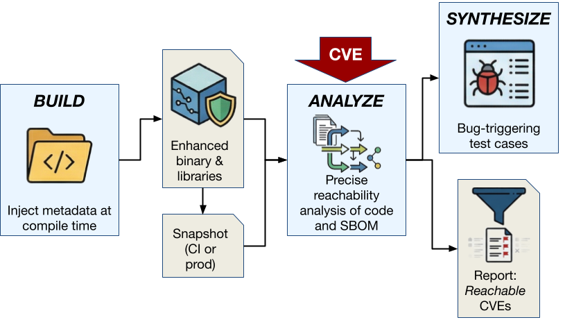

# BRACELET

BRACELET (Binary Reachability Analysis with Compiler-Enhanced Lifting for
Execution and Triage) is a set of tools for triaging vulnerabilities in the
dependencies of a C or C++ application.

## The problem it solves

When a vulnerability (e.g., a CVE) is discovered in a library, the level of
risk to downstream applications is not always clear. The vulnerable code may
not be present in an application due to build-time configuration. Even if it is
present, it may not be reachable in practice.

The state of the art is to use tools like [Dependabot] to alert developers
of vulnerabilities in their dependencies and to submit PRs to bump said
dependencies to a patched version. For applications with deep and wide
transitive dependency trees, these alerts can quickly become overwhelming and
lead to notification fatigue. Rushed upgrades can also come with their own risks
to security and stability.

[Dependabot]: https://docs.github.com/en/code-security/tutorials/secure-your-dependencies/dependabot-quickstart

Developers and security engineers need effective tooling to help prioritize
these reports. BRACELET fills this gap.

## How it works

BRACELET currently supports C and C++ applications built with [vcpkg].[^vcpkg]
The first step to using BRACELET is to compile the application and its
dependencies with the BRACELET toolchain. This toolchain embeds lightweight
metadata into the final enhanced application binary. This metadata later feeds
into BRACELET's analyses.

[vcpkg]: https://vcpkg.io/en/
[^vcpkg]: BRACELET is not *fundamentally* tied to vcpkg, and with a bit of work could be used with other build systems.

When a CVE is discovered in a dependency, a developer or user encodes
information about it (e.g., the affected package name, version, and function)
into a simple, small JSON file. BRACELET consumes this information and analyzes
the shipped enhanced binary to determine whether the vulnerability is reachable.

At a high level, BRACELET performs several tiers of analyses of escalating
complexity and power:

1. BRACELET first checks that the application was linked against the dependency
   version(s) that are affected by the vulnerability.
2. Next, it performs a form of precise yet scalable static analysis (pointer
   analysis) to construct a sound (i.e., overapproximate) and precise
   callgraph. If the vulnerable function is not reachable from `main`, the
   vulnerability is reported as unreachable.
3. If the vulnerability is deemed reachable, BRACELET supports synthesis of a
   test-case with [Screach], a tool for binary-level symbolic execution.

The first two steps are highly automated. The third generally requires some
manual intervention.

[Screach]: https://github.com/GaloisInc/grease/tree/main/screach

Notably, BRACELET's triaging capabilities do *not* require access to source
code. If an application was built the BRACELET toolchain, downstream users may
use BRACELET to triage even a closed-source application.

## Documentation

For more information about BRACELET, please consult [the documentation](./doc).

## YouTube Video

---

This material is based upon work supported by the Defense Advanced Research
Projects Agency under Contract No. HR001124C0488.

Any opinions, findings and conclusions or recommendations expressed in this
material are those of the author(s) and do not necessarily reflect the views of
the Defense Advanced Research Projects Agency or the U.S. Government.

Distribution Statement A. Approved for public release: distribution is
unlimited.
