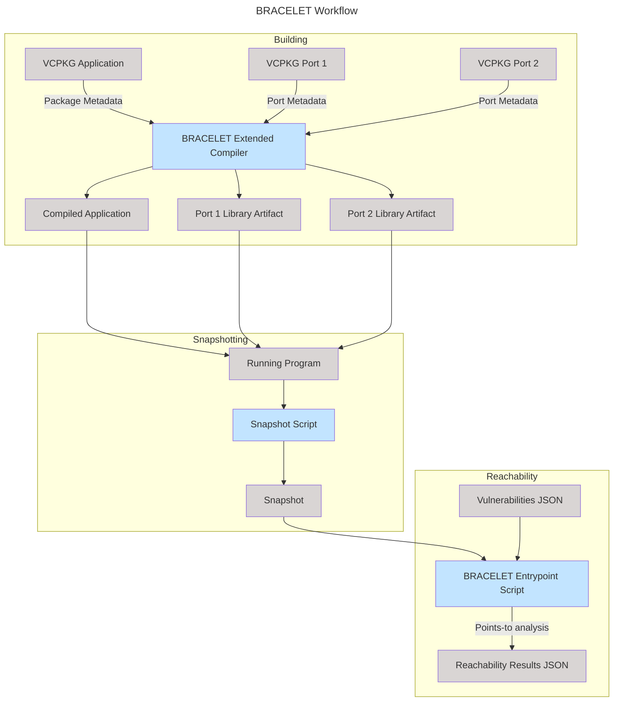
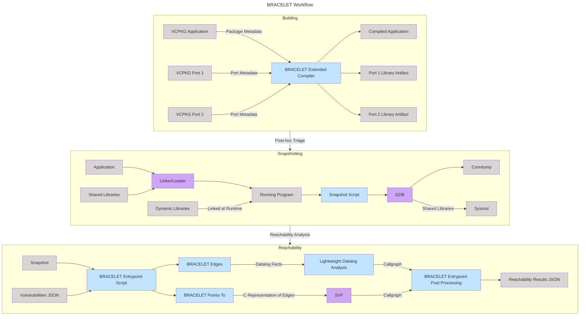
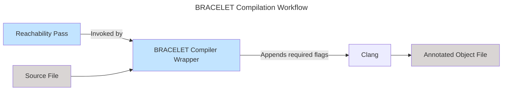

# Overview

BRACELET (Binary Reachability Analysis with Compiler-Enhanced Lifting for
Execution and Triage) is a set of tools for triaging vulnerabilities in the
dependencies of a C or C++ application. BRACELET assists security engineers
when triaging upstream vulnerability reports by automatically excluding
vulnerabilities that are unreachable in their specific application context.

BRACELET currently supports C and C++ applications built with [vcpkg].[^vcpkg]
The first step to using BRACELET is to compile the application and its
dependencies with the BRACELET toolchain. This toolchain embeds lightweight
metadata into the final enhanced application binary. This metadata later feeds
into BRACELET's analyses.

[vcpkg]: https://vcpkg.io/en/
[^vcpkg]: BRACELET is not *fundamentally* tied to vcpkg, and with a bit of work could be used with other build systems.

When a CVE is discovered in a dependency, a developer or user encodes
information about it (e.g., the affected package name, version, and function)
into [a simple, small JSON file](vulns.md). BRACELET consumes this information
and analyzes the shipped enhanced binary to determine whether the vulnerability
is reachable.

At a high level, BRACELET performs several tiers of analyses of escalating
complexity and power:

1. BRACELET first checks that the application was linked against the dependency
   version(s) that are affected by the vulnerability.
2. Next, it performs a form of precise yet scalable static analysis (pointer
   analysis) to construct a sound (i.e., overapproximate) and precise
   callgraph. If the vulnerable function is not reachable from `main`, the
   vulnerability is reported as unreachable.
3. If the vulnerability is deemed reachable, BRACELET supports synthesis of a
   test-case with [Screach], a tool for binary-level symbolic execution.

The first two steps are highly automated. The third generally requires some
manual intervention.

[Screach]: https://github.com/GaloisInc/grease/tree/main/screach

Notably, BRACELET's triaging capabilities do *not* require access to source
code. If an application was built the BRACELET toolchain, downstream users may
use BRACELET to triage even a closed-source application.

The following diagram shows the BRACELET workflow in a bit more detail:

The BRACELET entrypoint script consumes a snapshot and vulnerability description
and then orchestrates a reachability analysis. The script extracts metadata
using bracelet-edges to determine the address of function entrypoints associated
with each vulnerability. This matching checks for the existence of a target
symbol and that it came from the vulnerable version range specified in the
vulnerability.json. The script then constructs a callgraph either via a
lightweight datalog analysis or SVF pointer analysis. If the target function
is not in the callgraph the vulnerability is marked unreachable, otherwise the
function is labeled as potentially reachable and a sample callgraph path is
included as evidence.

Below is a detailed overview relating analysis steps to implementation details. For getting started read [this chapter](./getting-started.md) for installation instructions and the [Example 1 walkthrough](./example1.md) for a complete example.

## Detailed Overview

The following diagram expands on the one shown above with additional details:

And the compilation workflow:

The above graph shows how a single source file is compiled with points-to metadata. The BRACELET toolchain compiler wrapper generated from `build_base/compiler_wrapper.sh`
consumes a source file and produces an object file containing metadata in the `GR_graph_edges` and `GR_graph_debug` sections. The rest of the compilation process after 

The reachability LLVM pass located in 
`src/BRACELETReachability` traverses an LLVM module and creates globals in several sections that store tuples described in the [metadata](metadata.md) chapter.
