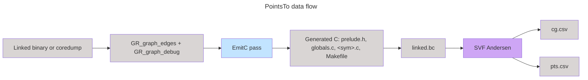

# Points-to Analyses

BRACELET's reachability analysis filters vulnerabilities by checking whether a
vulnerable function appears in an over-approximated whole-program callgraph
rooted at the application entrypoint. Building that callgraph requires
resolving indirect calls (function pointers, vtables, callbacks supplied to
APIs like `pthread_create` or `qsort`), which in turn requires a points-to
analysis over the linked program.

This chapter describes the current implementation in `src/PointsTo`, which
constructs an SVF-compatible C representation of the BRACELET edge metadata
and delegates the actual fixed-point computation to SVF's Andersen's analysis.

## Background

The original BRACELET design called for a custom field-sensitive points-to
analysis encoded as a Dyck-reachability problem over the embedded edge
graph. A prototype was implemented along those lines, but did not scale to
mid-sized targets, and bringing it to parity with state-of-the-art tooling
would have required substantial additional engineering and research. We kept
the existing metadata embedding scheme (`GR_graph_edges` / `GR_graph_debug` —
see [metadata](./metadata.md)) but replaced the custom solver with a generic
interface to off-the-shelf analyses, currently SVF.

## Approach

The PointsTo binary reads BRACELET metadata from a linked program (or a
coredump plus sysroot), emits a C program that reifies the recorded
points-to/dataflow edges, links it with the SVF clang/llvm-link toolchain, and
runs the SVF implementation of Andersen's points-to analysis on the resulting
bitcode. The `bracelet` fork of SVF has additional support for writing the
final callgraph and points-to relations as CSV files that are consumed by
downstream tools to build a callgraph and perform reachability analysis.



The key idea is that the BRACELET edge metadata is already a graph encoding of
the program's pointer flow at a granularity sufficient for points-to analysis.
By emitting a small C program in which each metadata edge becomes a
straight-line C statement guarded by a non-deterministic choice, we let SVF
treat our graph as if it were the source program: SVF's standard inclusion
constraints, indirect-call resolution, and external-API models all apply
unchanged.

### Worked example

Consider a fragment of cJSON's `parse_object`:

```c
static cJSON_bool parse_object(cJSON * const item, parse_buffer * const input_buffer) {
    cJSON *head = NULL;
    cJSON *current_item = NULL;
    if (input_buffer->depth >= CJSON_NESTING_LIMIT)
        return false;
    input_buffer->depth++;
    /* ... parse an object ... */
    G_parse_string(item, input_buffer);
    G_parse_value(item, input_buffer);
    /* ... */
}
```

The BRACELET pass records, for each LLVM value of pointer type, a node, and
for each pointer-relevant operation (assignment, load, store, call, return,
argument passing, dlsym site) an edge. Emission turns those nodes and edges
into a representative C function:

```c
void *G_parse_object(void *arg0, void *arg1) {
  void *L_0x1a;       // local nodes (allocas, SSA pointers, ...)
  void *L_0x55;
  void *L_0x3e;
  void *L__input_buffer;
  void *L_call64;
  void *L__item;
  while (__nondeterministic_choice()) {
    NONDET L__item = arg0;            // ArgumentDefinition
    NONDET L__input_buffer = arg1;    // ArgumentDefinition
    NONDET DEREF(L_0x1a) = L_0x1a;    // Store
    NONDET DEREF(L__item) = L_0x1a;
    NONDET L_call64 =
        G_parse_string(L_0x1a, L__input_buffer);   // Call
    NONDET L_0x3e =
        G_parse_value(L_0x1a, L__input_buffer);
    NONDET L_0x1a =
        ((function_0)(DEREF(L__input_buffer)))();  // indirect Call
    NONDET L_0x55 = G_cJSON_Delete(L_0x1a);
  }
  return (void *)0x0;
}
```

Three properties matter:

1. Every pointer node is typed `void *` (`T` in the
   [templates](#edge-to-c-mapping)). Field sensitivity, struct layout, and
   arithmetic are deliberately discarded — the analysis is field-insensitive by
   design.
2. Each edge is wrapped in a `NONDET` (`if (__nondeterministic_choice())`)
   inside an outer `while (__nondeterministic_choice())` loop. This makes the
   emitted code order-insensitive: SVF cannot rely on any particular execution
   order, so the resulting points-to relation is a sound over-approximation of
   every possible interleaving of the recorded edges.
3. `alloca`s become `malloc(__nondeterministic_choice())`, and globals get an
   initializer that does the same. `__nondeterministic_choice` is left
   undefined so SVF treats it as returning an arbitrary value.

## Edge to C mapping

The full template is in `src/PointsTo/templates/c.txt`. Locals are rendered as
`local_<idx>_NODE_<func_addr>` and symbols as `NODE_<addr>`; here we use
shorthand. `T` is `void *`. Each row below is wrapped in `NONDET` inside the
outer `while (__nondeterministic_choice())` body of the emitting function.

| Edge                 | Operands                    | Emitted C                                                                                                                                        |
|----------------------|-----------------------------|--------------------------------------------------------------------------------------------------------------------------------------------------|
| `Assign`             | `(dest, source)`            | `dest = source;`                                                                                                                                 |
| `Load`               | `(into, addr)`              | `into = *((T*)addr);`                                                                                                                            |
| `Store`              | `(addr, value)`             | `*((T*)addr) = value;`                                                                                                                           |
| `Call`               | `(callsite, callee, nargs)` | `callsite = callee(call_arg_<callsite>_0, ..., call_arg_<callsite>_{nargs-1});` (callees that are local nodes are first cast to `T(*)(T,...,T)`) |
| `Return`             | `(func, value)`             | `return value;` (emitted inside the function whose symbol is `func`)                                                                             |
| `ArgumentDefinition` | `(value, func, arg_no)`     | `value = arg<arg_no>;` (emitted in the callee)                                                                                                   |
| `ArgumentSupply`     | `(callsite, value, arg_no)` | `call_arg_<callsite>_<arg_no> = value;` (emitted in the caller, before the matching `Call`)                                                      |
| `DlsymPagePointer`   | `(dlsym_output, page_ptr)`  | For each runtime pointer `p` recorded in the dlsym page chain rooted at `page_ptr`, emit `dlsym_output = NODE_p;`                                |

In addition, for each function:

* The first `num_allocas` locals are initialized with
  `local_i = malloc(__nondeterministic_choice());` at function entry (outside
  the `while` loop), modelling stack allocations as fresh heap objects.
* For each `Call` edge, a temporary `T call_arg_<callsite>_<i>` is declared
  per argument so that `ArgumentSupply` and `Call` can refer to them
  symbolically without ordering constraints between supplier and call.

### Globals

Globals are declared in `globals.c` and initialized in
`bracelet_global_init_<name>` to a fresh `malloc`. SVF's main entry,
synthesized by the SVF Makefile, is unimportant for callgraph purposes; what
matters is that the analysis sees the global as a possible target for any
edge whose endpoint is that symbol.

## Node states

While walking edges, the emitter classifies each non-local symbol node into
one of three states (`PointsTo.cpp::NodeState`):

* `NodeStateUndefined` — bottom of the lattice; symbol seen but role not yet
  determined.
* `NodeStateGlobalData` — a non-function global; emitted as `extern T <sym>;`.
* `NodeStateFunction(nargs)` — emitted as `extern T <sym>(T arg0, ..., T
  arg{nargs-1});`. `nargs` is the maximum of (a) the largest `arg_no` plus
  one observed in `ArgumentDefinition` edges in that function and (b) the
  `nargs` seen on any `Call` edge whose callee is that symbol.

`Store` edges whose `addr` is a global force the global into
`NodeStateGlobalData`. Mismatched assignments to the function lattice cell
(differing arities for the same symbol) are reported as errors.

## External overrides (prelude)

`src/PointsTo/templates/prelude.txt` defines `DEF_OVERRIDE` /
`DEF_OVERRIDE_INLINE` macros that supply hand-written models for libc, libstdc++,
and pthreads functions whose pointer behaviour SVF needs to see explicitly. A
symbol referenced in the metadata that matches a name in `override_nargs`
(populated by the prelude) is redirected via
`#define <sym> OVERRIDE(<name>)`, so calls in the emitted C end up dispatched
to the prelude's model rather than to an opaque extern.

Three flavours of override appear in the prelude:

* **Allocators** (`malloc`, `calloc`, `realloc`, `posix_memalign`,
  `mmap`, `_Znwm`, `fopen`, ...): forward to the real libc allocator with
  `__nondeterministic_choice()` for size arguments. SVF's `extapi.bc`
  recognizes the underlying allocator names so the returned pointer is
  treated as a fresh allocation site.
* **Empty models** (`free`, `strlen`, `strcmp`, `pthread_mutex_lock`,
  `clock_gettime`, ...): take their arguments and return `NULL`. Used when
  the function neither reads nor produces pointers relevant to points-to.
* **Conservative models** (`_Rb_tree_*` and friends): mix all arguments via
  a chain of stores/loads through a fresh allocation, used when we want SVF
  to assume the function may shuffle pointers among its arguments.

A few overrides encode application-specific dataflow that SVF would not
otherwise see, most importantly:

* `pthread_create(thread_out, attr, start_routine, arg)` calls
  `start_routine(arg)` directly inside the model, so the start routine's
  callgraph edge from `pthread_create`'s caller is preserved.
* `qsort` / `qsort_r` invoke their comparator on the array base pointer.
* `fopencookie` plumbs the cookie functions struct into a fake `FILE`.

## Conservative mode

If `--conservative` is passed, every symbol declared (in the prelude or by
the metadata as a function) but never *defined* by the metadata receives a
synthesized body from `templates/conservative.txt`. The body mixes all
arguments via stores/loads through a fresh allocation, so missing code is
modelled as "may read, write, and return any pointer reachable from the
arguments". Without `--conservative`, missing functions remain extern and
SVF treats them with its default external-API behaviour. The list of
emitted-but-undefined functions is always written to `missing.txt` in the
work directory regardless of mode.

## SVF invocation

The emitted directory contains:

```
prelude.h        # extern declarations + override models
globals.c        # global definitions and per-global initializers
0x<addr>.c       # one file per defined function
missing.txt      # symbols referenced but not defined by metadata
Makefile         # builds linked.bc with SVF's clang
```

The `Svf` helper in `PointsTo.cpp` runs:

```
make linked.bc
bracelet -ander -ind-call-limit=4294967295 \
    -extapi=$SVF/lib/extapi.bc \
    [-bracelet-pointsto=pts.csv] \
    -bracelet-callgraph=cg.csv \
    linked.bc
```

If SVF is not installed locally (no `$SVF_DIR` directory present), the
helper falls back to invoking it via `podman` or `docker` against the
`gitlab.ebossproject.com:5005/galois/svf/svf:galois-3.1` image, with the work
directory bind-mounted in.

`cg.csv` records resolved indirect-call targets and is consumed by the
reachability pipeline. `pts.csv` (only emitted with `--save-pts`) is parsed
back into a `PointsToEdges` set — a `flat_hash_set<pair<Node, Node>>` —
when `computePointsTo` is used in-process; entries are of the form
`<src_addr>\t<src_local|->\t<dst_addr>\t<dst_local|->`.

## Validating against runtime traces

`checkPointsToAgainstTrace` cross-checks the static points-to result against
dynamic traces collected by the BRACELET runtime, primarily for soundness
debugging during development.

The runtime emits two kinds of artifact:

* **Trace sites**: a `BraceletTraceSite` table embedded in the binary that
  maps trace-site addresses to `(function_symbol, local_idx)` pairs — i.e.,
  the `edges::Node` for the value being traced.
* **Trace edges**: pairs `(trace_site, observed_value)` written to per-thread
  files in a traces directory. `observed_value` may be either another trace
  site (a tracked local) or any other address, which is resolved to a symbol
  via lldb.

For each `(trace_site, value)` pair observed at runtime, the checker
constructs the corresponding `(Node, Node)` edge and verifies that it is
present in the static `PointsToEdges` set. Any edge witnessed dynamically but
absent from the static result is unsoundness in the pipeline (lost edge
during emission, missing override, SVF approximation gap, ...) and is
reported with full source-level names; the run terminates with an error
listing the missing edges and the total count of trace edges checked.

This mode is enabled by passing `--trace-dir <dir>` together with `--core`;
it forces `save_pts` so that the points-to relation is materialized for
comparison.

## Command-line interface

The `points-to` binary is normally driven by the analysis entrypoint script
(see the [Example 1 walkthrough](./example1.md)), but can be invoked directly:

```
points-to <executable>
    [--svf-dir <path>]      # SVF install directory; default /opt/svf
    [--clang-dir <path>]    # SVF's clang install; default $SVF_DIR/llvm-16.0.0.obj
    [--llvm-dir <path>]     # SVF's llvm-link install; default $SVF_DIR/llvm-16.0.0.obj
    [--sysroot <path>]      # required with --core: search root for shared libraries
    [--core <coredump>]     # operate on a coredump rather than the linked binary
    [--trace-dir <path>]    # validate static results against runtime traces (requires --core)
    [--tmp <path>]          # use this directory for emission and SVF outputs (kept across runs)
    [--conservative]        # synthesize bodies for declared-but-undefined functions
    [--save-pts]            # emit pts.csv in addition to cg.csv
```

If `--tmp` is omitted, a fresh temporary directory is created and removed at
exit. `--trace-dir` implies `--save-pts`.

## Status and known limitations

* The analysis is field-insensitive and context-insensitive: the emitted C
  collapses every pointer to `void *` and runs Andersen-style inclusion. This
  is sufficient for the current reachability use-case but loses precision on
  programs whose pointer behaviour is dominated by per-field flow.
* SVF does not always terminate in reasonable time on large targets (Example 1
  is one such case; see the [walkthrough](./example1.md)). Adding field/context
  sensitivity and improving
  scalability remain open work items.
* Weak-symbol metadata is "last writer wins" (see [metadata](./metadata.md));
  this carries through to points-to, where the emitted body for a weakly-bound
  function is whichever definition's metadata was loaded last.
